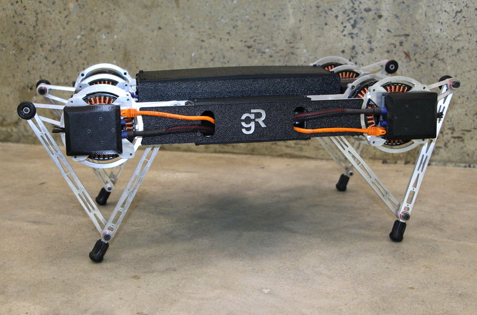
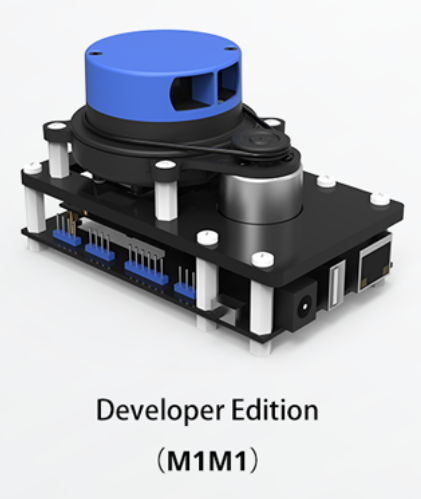
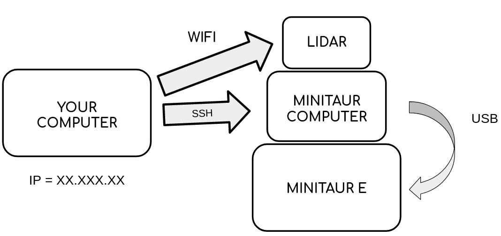
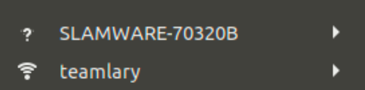
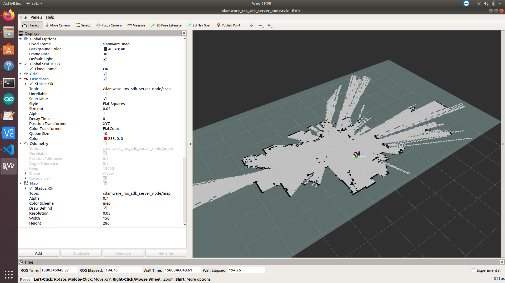

# MinitaurE_ROS
A package that allows manual and autonomous control of the Minitaur E from Ghost Robotics, using the Robot Operating System (ROS)



# What I've Learned
* How to use the Robot Operating System (ROS) in order to send and recieve data over a network
* How to perform Simultaneous localization and mapping (SLAM) using ROS. 

## Hardware
* This package was written with the assumption that the Minitaur E uses a [SLAMETECH MAPPER M1M1 (Developer Edition)](https://www.slamtec.com/en/Lidar/Mapper) for autonomous navigation. 



* MinitaurE_ROS assumes that there are two computers connected to the same network: one directly mounted to the Minitaur itself (which sends movement commands over USB), and a MAIN_COMPUTER, which is used to remotely control the robot over an SSH connection. 



* Manual control of the robot is achieved with an [XBOX ONE WIRELESS CONTROLLER](https://www.amazon.com/Xbox-Wireless-Controller-Black-one/dp/B01LPZM7VI?th=1), which is connected to the MAIN_COMPUTER.

## Software
* Create a machine running Ubuntu 18.04+ (both machines)
* [Install ROS Melodic](http://wiki.ros.org/melodic/Installation/Ubuntu) (both machines)
* [Install the Ghost Robotics SDK](https://gitlab.com/ghostrobotics/SDK/-/jobs/artifacts/master/download?job=deploy_artifact) (MINITAUR_COMPUTER only)
* You'll need TWO wifi capable adapters (One for connecting to the robot's onboard computer, and another for connecting to the LiDAR's wifi network) (MAIN_COMPUTER only)

## Installation
1. After installing ROS, [create a catkin workspace](http://wiki.ros.org/catkin/Tutorials/create_a_workspace), if you haven't already.

2. Clone the contents of this directory to (YOUR CATKIN_WS LOCATION)/src

3. Build the workspace 
```python
cd (YOUR CATKIN_WS LOCATION)
catkin_make
```

4. Modify the bashrc on BOTH COMPUTERS so that the ROS_IP, ROS_MASTER_URI and ROS_HOSTNAME_IP have the correct values 

## How To Use This Package
1. Turn on the LiDAR and the MINITAUR_COMPUTER. Make sure you're connected to the network of the LiDAR and that of the MINITAUR_COMPUTER



3. Open a terminal and start the ROS Master
```python
roscore
```

4. Open another terminal and start the local ROS nodes 
```python
roslaunch minitaur_ros minitaur_client_nodes.launch
```

5. Turn on the minitaur

6. Open another terminal and start the ROS nodes on the onboard computer (MAKE SURE THAT THE ROBOT IS SUPPORTED UNDERNEATH - THE LEGS WILL GO LIMP TEMPORARILY) 
```python
ssh odroid@10.42.0.1
roslaunch minitaur_ros minitaur_odroid_nodes.launch
```

7. You should now be able to control the robot via a USB controller or through the \cmd_vel topic. You can also use rviz to give the robot waypoints.




